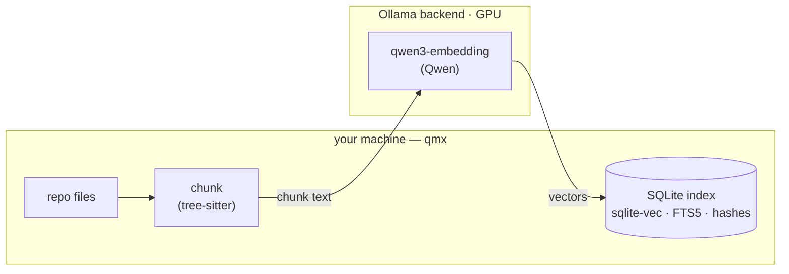
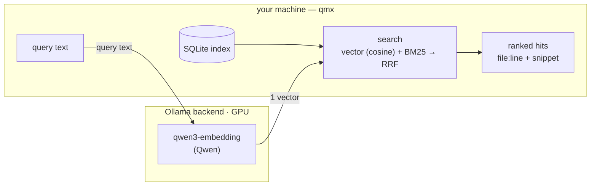
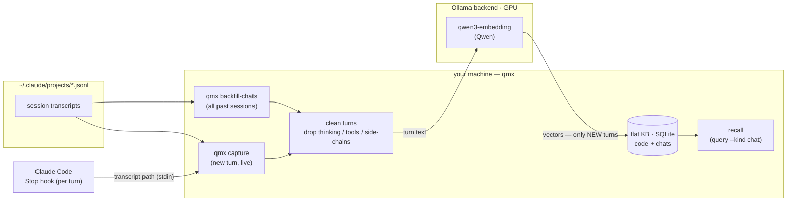

# qmx — Query Memory indeX

Local, private semantic search over your **code and chats**.

qmx indexes source repositories (AST-aware) and your Claude Code conversation history into an
on-device vector + full-text index, and serves them by *meaning* to agents via MCP — or to you on
the command line. Everything runs on hardware you control — no cloud service.

Powered by the [Qwen](https://github.com/QwenLM) embedding/rerank models and
[`sqlite-vec`](https://github.com/asg017/sqlite-vec). Derived from
[`tobi/qmd`](https://github.com/tobi/qmd) (MIT).

**Start here:** [QUICKSTART.md](./QUICKSTART.md) (install → index → use from Claude Code) ·
[INFRA.md](./INFRA.md) (the Ollama backend + services) · [plan/](./plan) (design).

## Why

- **Find by meaning, not grep** — "where's the launcher logic" instead of guessing symbol names.
- **Remember conversations** — semantic recall across every past Claude Code session.
- **Private by construction** — code and chats are embedded by an Ollama backend you control and
  stored in a local index — never sent to a cloud service.

## Architecture

qmx is two cooperating pieces joined by one config knob (`QMX_OLLAMA_URL`):

- **qmx** (this tool) — the **index and search**: chunking, the SQLite store (`sqlite-vec` + FTS5),
  hybrid ranking, the CLI, and the MCP server all run **on your machine**.
- **An Ollama backend** — produces the **embeddings** with a **Qwen** model. It can be the *same*
  machine, or a GPU box on your LAN (e.g. a DGX Spark). The only thing that crosses to it is the
  text being embedded; the index and all search stay local.

So you can run everything on one laptop, or keep the index local and offload embeddings to a GPU box.

**Indexing** — files → chunks → vectors (on the backend) → local SQLite index:



**Querying** — only the query string is embedded on the backend; vector + keyword search and
ranking are entirely local:



**Chat memory** — Claude Code transcripts feed the *same* flat KB two ways: `qmx backfill-chats`
imports past sessions once, and a Claude Code `Stop` hook runs `qmx capture` on every finished turn.
Both clean the JSONL to plain turns and reuse the incremental pipeline, so only *new* turns embed;
`recall` (or `query --kind chat`) reads them back:



Choose where the backend lives with `QMX_OLLAMA_URL` and which model embeds with `embed_model`
(see [QUICKSTART.md](./QUICKSTART.md)). Reranking is a seam after RRF — currently off (RRF-only);
see [plan/qmx-ml-notes.md](./plan/qmx-ml-notes.md).

## Status

Phase 4 (chats) landing: qmx now indexes your Claude Code **conversation history** alongside code —
`qmx backfill-chats` for past transcripts and a `Stop` hook (`qmx capture`) for live turns, recalled
via the `mcp__qmx__recall` tool. Built on the resident **MCP server** (Phase 3), tree-sitter
chunking, incremental indexing, and hybrid **vector + BM25 → RRF** search. Reranking is deferred
(RRF-only) — see [`plan/qmx-ml-notes.md`](./plan/qmx-ml-notes.md). See [`plan/`](./plan) for the design.

## Development

Python 3.12 + [`uv`](https://docs.astral.sh/uv/). The model backend (Ollama) runs on the DGX Spark
in prod; point at it with `QMX_OLLAMA_URL` (see [`plan/qmx-deployment.md`](./plan/qmx-deployment.md)).

```bash
uv sync                         # create the venv, install qmx + dev tools
uv run pytest                   # unit tests (live-Ollama tests skip when unreachable)
uv run ruff check . && uv run ruff format --check .
uv run qmx status               # resolved config + index stats

# index code and search it (needs a running Ollama backend):
export QMX_OLLAMA_URL=http://spark-0e81.local:11434
uv run qmx index ~/some/repo
uv run qmx query "where is the retry logic" -k 5
uv run qmx watch ~/some/repo    # keep the index live as files change
uv run qmx gc                   # purge tombstoned chunks

# run the live embed round-trip against the Spark:
uv run pytest -m integration
```

## Use from Claude Code (MCP)

Run the resident server (on the Spark in prod; it owns the index + background loops):

```bash
uv run qmx serve                       # HTTP on 127.0.0.1:8765/mcp by default
QMX_MCP_HOST=0.0.0.0 uv run qmx serve  # bind to the LAN so other machines can reach it
```

Register it with Claude Code — either the CLI:

```bash
claude mcp add --transport http qmx http://spark-0e81.local:8765/mcp
```

…or in `settings.json`:

```json
{ "mcpServers": { "qmx": { "type": "http", "url": "http://spark-0e81.local:8765/mcp" } } }
```

The tools then appear as `mcp__qmx__query`, `mcp__qmx__search_code`, `mcp__qmx__get`,
`mcp__qmx__status`. (`qmx serve --transport stdio` is available for a local, single-client setup.)

## License

MIT — see [LICENSE](./LICENSE).
