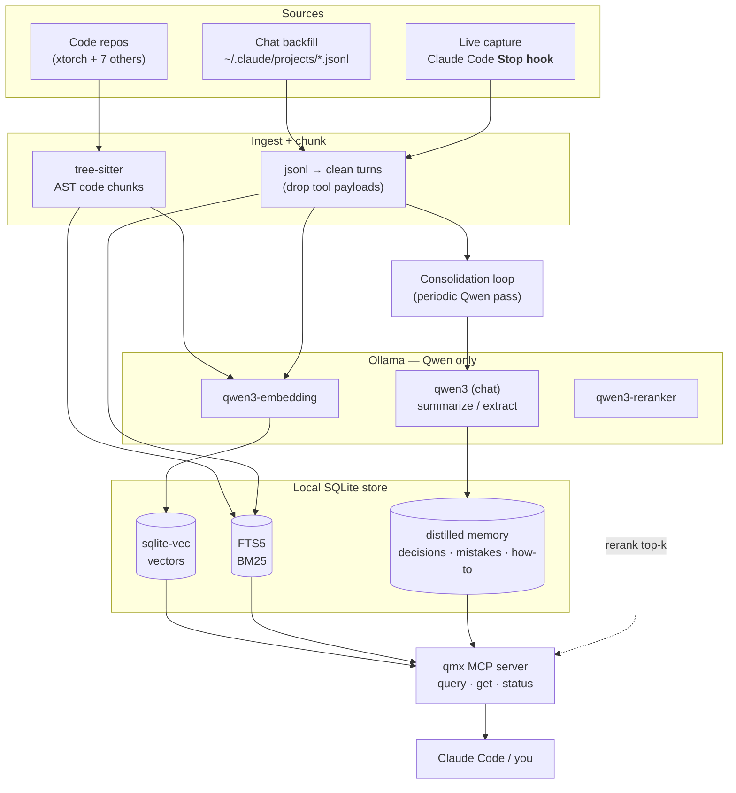
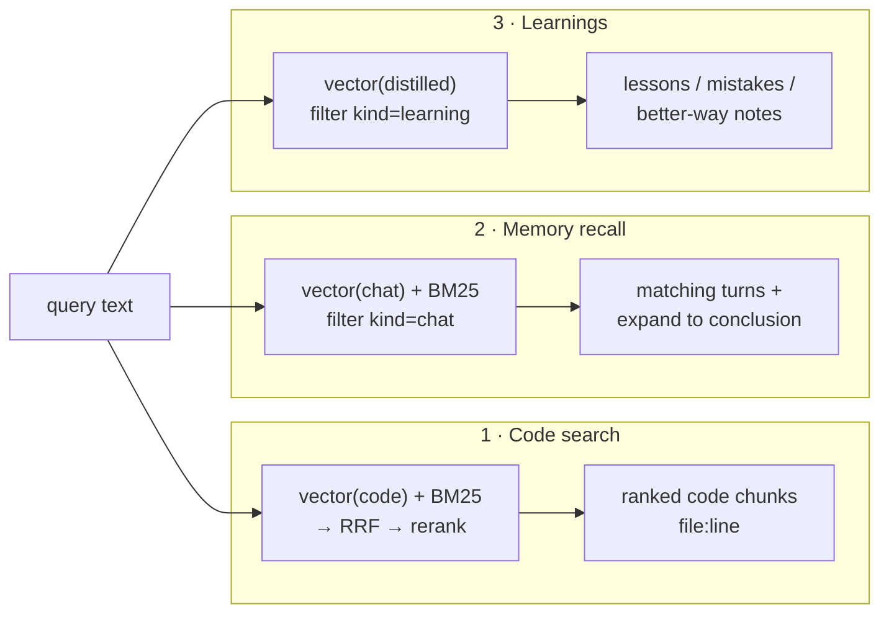

# qmx — Architecture & the Three Capabilities

qmx delivers three capabilities on **one shared pipeline** (chunk → Qwen-embed via Ollama →
sqlite store → search). They differ mostly in *what* is indexed and *which* query path runs.

1. **Quick semantic search over code** — find code by meaning, fast.
2. **Memory recall** — "when did we discuss X, and what did we conclude?"
3. **Chat summarization / learning** — distill past chats into lessons: mistakes made, better ways
   to do things. (Borrows the *always-on-memory-agent* Ingest→Consolidate→Query pattern.)

## Unified data flow

## How each capability is served

| Capability | Indexed content | Ingest path | Query path | Answers |
|---|---|---|---|---|
| **1 · Code search** | code chunks (`kind=code`) | tree-sitter → embed → vec+FTS | vector+BM25 → RRF → rerank | "where's the launcher logic" → `xtorch.py:591` |
| **2 · Memory recall** | chat turns (`kind=chat`) | jsonl/live → clean → embed → vec+FTS | vector+BM25, `kind=chat`, expand hit → surrounding turns | "when did we discuss local embeddings, and the conclusion?" → the turns + the decision |
| **3 · Learnings** | distilled notes (`kind=learning`) | **consolidation loop**: Qwen reads recent chats → extracts decisions/mistakes/how-to → dedups/updates → stores | vector over `kind=learning` | "how should I raise a gcp-infra IAM PR" → "project-level, ask in #platform-security-support (learned 2026-07)" |

## Capability #3 — the "learning" layer (always-on-memory pattern, localized)

The always-on-memory-agent does **Ingest → Consolidate → Query**; #3 adapts it to local Qwen:

- **Ingest** (cheap, per-turn): the Stop hook already writes clean turn markdown. Tag salient turns.
- **Consolidate** (periodic — a timer or on-demand, mimicking "sleep consolidation"): a Qwen pass
  reads recent/unconsolidated chats and extracts structured **learnings**:
  - `decision` — what we concluded and why
  - `mistake` — what went wrong + the correction (→ "learn from past mistakes")
  - `howto` — a better/repeatable way to do a task (→ "do things better")
  - each with `topic`, `importance`, `source session anchors`.
  - **Dedup/update:** if a learning matches an existing one, update it (don't duplicate) — the
    consolidation step merges and compresses, exactly like the reference agent's insight-generation.
- **Query** (retrieval-time): learnings are embedded and searchable; the MCP `query` can return them
  alongside code/chat hits, or an agent can pull them at session start.

This is the tier that turns raw recall (#2) into *usable* lessons (#3). It complements your existing
curated `~/.claude/.../memory/` files — qmx auto-generates candidate learnings; the curated files
stay the hand-picked canon.

> The parallel research pass on the always-on-memory-agent will refine this section (extraction
> triggers, importance scoring, consolidation cadence, memory-type taxonomy) before Phase 4.

## Where this sits in the plan

- Capabilities **1 & 2** are delivered by Phases 0–4 of [qmx-plan.md](./qmx-plan.md) (store → code
  slice → robustness → MCP → chats).
- Capability **3** (consolidation/learnings) is an addition to Phase 4/5: the `consolidate` step +
  `kind=learning` documents + a periodic trigger.
