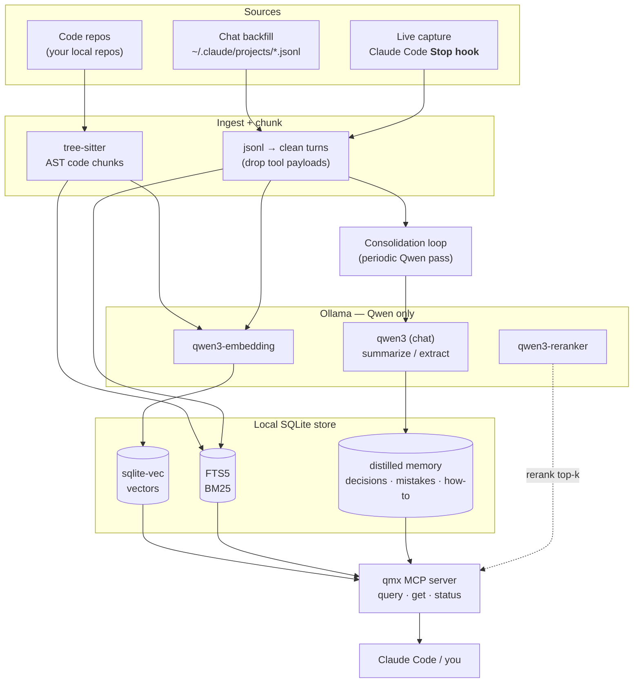
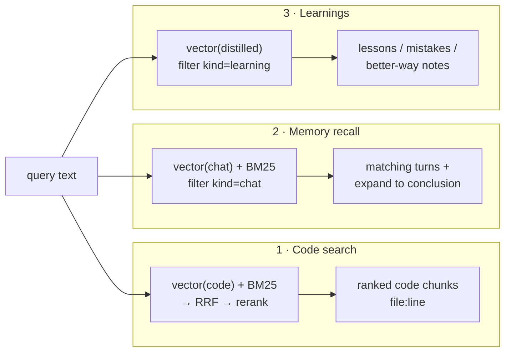

# qmx — Architecture & the Three Capabilities

qmx delivers three capabilities on **one shared pipeline** (chunk → Qwen-embed via Ollama →
sqlite store → search). They differ mostly in *what* is indexed and *which* query path runs.

1. **Quick semantic search over code** — find code by meaning, fast.
2. **Memory recall** — "when did we discuss X, and what did we conclude?"
3. **Chat summarization / learning** — distill past chats into lessons: mistakes made, better ways
   to do things. (Borrows the *always-on-memory-agent* Ingest→Consolidate→Query pattern.)

## Unified data flow



## How each capability is served



| Capability | Indexed content | Ingest path | Query path | Answers |
|---|---|---|---|---|
| **1 · Code search** | code chunks (`kind=code`) | tree-sitter → embed → vec+FTS | vector+BM25 → RRF → rerank | "where's the retry logic" → `client.py:142` |
| **2 · Memory recall** | chat turns (`kind=chat`) | jsonl/live → clean → embed → vec+FTS | vector+BM25, `kind=chat`, expand hit → surrounding turns | "when did we discuss local embeddings, and the conclusion?" → the turns + the decision |
| **3 · Learnings** | distilled notes (`kind=learning`) | **consolidation loop**: Qwen reads recent chats → extracts decisions/mistakes/how-to → dedups/updates → stores | vector over `kind=learning` | "how should I raise a gcp-infra IAM PR" → "project-level, ask in #platform-security-support (learned 2026-07)" |

## Capability #3 — the "learning" layer (always-on-memory pattern, localized + improved)

The reference always-on-memory-agent's transferable core is **episodic-write → periodic-LLM-
consolidate → cite-on-retrieve**, driven by a `consolidated` flag. But it is intentionally
*LLM-as-memory with no vectors*, and its omissions are precisely what a "learn from mistakes" layer
needs. qmx keeps the good pattern and fixes the gaps:

**Borrow as-is:**
- **Two tiers:** raw episodic turns (tier 1) + a periodic **consolidation** pass that distills
  higher-order **learnings** (tier 2). The consolidation pass is where "in session X we did Y and it
  failed" becomes a reusable rule.
- **`consolidated` flag** as a restart-safe cursor over "what still needs distilling"; a
  `processed` table for idempotency.
- **Structured extraction** (Qwen emits JSON: summary + topics + importance) with `raw_text`/anchor
  retained so the original is never lost.
- **Citation discipline:** answers/learnings cite their source session anchors — traceable which
  past lesson fired.

**Fix the reference's weaknesses (these are qmx's #3 requirements):**
- **Explicit learning `type`** — `decision` (what we concluded + why) · `mistake` (what went wrong +
  the correction) · `howto` (a better/repeatable way). The reference has no "mistake/lesson" type at
  all; this is the heart of "do it better next time."
- **Dedup + update/supersede** — the reference blind-`INSERT`s and duplicates. qmx: on new learning,
  vector-match against existing ones; Qwen decides new vs update vs **supersede** (a `superseded_by`
  column) so a corrected lesson *replaces* the stale one.
- **Vector retrieval, importance-weighted** — the reference ranks by *recency only* and ignores its
  own importance score (falls off a `LIMIT 50` window as it grows). qmx retrieves `kind=learning` by
  **relevance × importance × recency** using `sqlite-vec` — we already have vectors, so we do **not**
  copy their no-vectors choice.

**Trigger (localized):** instead of a 30-min wall-clock timer, consolidation runs **on session end
or after N new turns accumulate** — a natural fit for a chat tool, wired as a Claude Code
`SessionEnd` hook (or a counter in `qmx capture`). Extraction stays cheap (per-turn tagging);
consolidation is the heavier Qwen batch pass.

**Simplify away** (irrelevant locally): the reference's multimodal ingest (27 formats), inbox
file-watcher, aiohttp HTTP server, Streamlit dashboard, and 3-agent ADK orchestration → qmx needs
just two Qwen prompts (extract, consolidate) + the existing vector retrieve.

This turns raw recall (#2) into *usable* lessons (#3). It complements your curated
`~/.claude/.../memory/` files — qmx auto-drafts candidate learnings (with supersede so they self-
correct); the curated files stay the hand-picked canon.

### Learnings store (extends the schema)

```sql
CREATE TABLE learnings (
  id INTEGER PRIMARY KEY,
  type TEXT,                 -- decision | mistake | howto
  topic TEXT,
  statement TEXT,            -- the lesson, one crisp sentence
  detail TEXT,               -- why / the correction / the better way
  importance REAL,           -- 0..1, USED in retrieval ranking
  source_anchors TEXT,       -- JSON: session UUIDs + turn refs (citations)
  superseded_by INTEGER,     -- points to the newer learning that replaced this
  created_at TEXT,
  consolidated INTEGER DEFAULT 0
);
-- learnings.statement+detail are also embedded into vec_chunks (kind=learning) for retrieval.
```

## Where this sits in the plan

- Capabilities **1 & 2** are delivered by Phases 0–4 of [qmx-plan.md](./qmx-plan.md) (store → code
  slice → robustness → MCP → chats).
- Capability **3** (consolidation/learnings) is an addition to Phase 4/5: the `consolidate` step +
  `kind=learning` documents + a periodic trigger.
