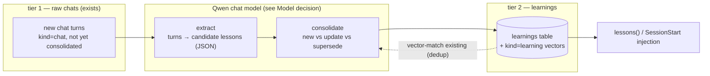

# qmx — Learnings & Consolidation (Capability #3) — implementation spec

Turns **raw recall** (`kind=chat` — past turns verbatim) into a **distilled tier** of reusable
lessons (`kind=learning`): *decisions*, *mistakes+corrections*, and *how-tos*, auto-drafted from
chats by a Qwen chat model, deduped/superseded so they self-correct, and **proactively injected** at
session start so the agent starts already knowing.

Design rationale (episodic-write → periodic-LLM-consolidate → cite-on-retrieve, and why we improve on
the reference always-on-memory pattern) lives in
[qmx-architecture.md](./qmx-architecture.md#capability-3). This doc is the buildable plan: schema,
pipeline, tools, triggers, phasing, and the **model decision**.

## What exists today (the gap)

Grep-confirmed: `"learning"` is only a *nominal* `kind` (a comment in `store.py`, the `query`
docstring, the `--kind` help). **No** `learnings` table, consolidation, `lessons`/`add_learning`
tools, or chat-model call. `Settings.chat_model = "qwen3"` is defined but **never invoked**. So
Capability #3 is 0% built; this spec is greenfield on top of the existing store/embed/search/MCP.

## Data model (schema v4)

```sql
CREATE TABLE learnings (
  learning_id   INTEGER PRIMARY KEY,
  type          TEXT NOT NULL,        -- decision | mistake | howto
  topic         TEXT,                 -- short slug for filtering/injection (e.g. "cpe-intelligence/dags")
  scope         TEXT,                 -- repo/project this applies to, or NULL = global
  statement     TEXT NOT NULL,        -- the lesson, one crisp sentence
  detail        TEXT,                 -- why / the correction / the better way
  importance    REAL NOT NULL,        -- 0..1, USED in retrieval ranking
  source_anchors TEXT,                -- JSON: [{session, transcript_path, line}] citations
  superseded_by INTEGER REFERENCES learnings(learning_id),  -- newer lesson that replaced this
  created_at    TEXT DEFAULT (datetime('now')),
  updated_at    TEXT DEFAULT (datetime('now'))
);
-- statement+detail are also embedded into the existing chunk/vec/fts tables as kind="learning"
-- (one chunk per learning) so retrieval reuses vector + BM25 + rerank unchanged.

CREATE TABLE consolidated (               -- restart-safe cursor: which turns are already distilled
  chunk_id  INTEGER PRIMARY KEY REFERENCES chunks(chunk_id),
  at        TEXT DEFAULT (datetime('now'))
);
```

Live learnings = `superseded_by IS NULL`. Superseded ones are kept (audit trail) but excluded from
retrieval. The `consolidated` table (a `processed`-style cursor) makes the extraction pass idempotent
and resumable — re-running never re-distills the same turns.

## Pipeline



1. **Extract** (`extract_learnings(turns) -> [candidate]`): a Qwen pass over the un-`consolidated`
   turns of a session. Emits **structured JSON** candidates: `{type, topic, scope, statement, detail,
   importance, source_anchors}`. Prompted to keep only durable, reusable lessons (a decision + its
   why; a mistake + its correction; a repeatable how-to) and drop chit-chat. Cheap; runs per session.
2. **Consolidate** (`consolidate(candidate)`): for each candidate, vector-search existing
   `kind=learning` for near-duplicates; a Qwen call decides **new / update / supersede**. Supersede
   sets `superseded_by` on the stale row (self-correction). Prevents the blind-INSERT duplication of
   the reference design.
3. **Store**: insert/patch the `learnings` row; (re)embed `statement + detail` as a `kind=learning`
   chunk; mark the source turns `consolidated`.
4. **Retrieve** (`lessons(query|topic, type?, k)`): vector + BM25 over `kind=learning`, re-ranked by
   **relevance × importance × recency** (not relevance alone), returning lessons **with citations**.
5. **Inject** (SessionStart): call `lessons` for the current project/topic and surface the top few so
   the agent starts already knowing "last time bucket-level IAM failed → use project-level."

## Triggers & wiring (Claude Code hooks)

- **`SessionEnd`** (or a turn counter in `qmx capture`) → `qmx consolidate` on that session's
  transcript. Consolidation is the heavier batch pass; keep it off the per-turn hot path.
- **`SessionStart`** → `qmx lessons --scope <cwd-project> --inject` prints relevant lessons into the
  session context (the "proactive injection" payoff — turns passive lookup into "learn from
  mistakes").
- Both are `settings.json` hooks (harness-executed), added via the update-config skill, like the
  existing `Stop` capture hook.

## Surfaces

- **CLI:** `qmx consolidate [--session <path>] [--all]`, `qmx lessons <query|--topic> [--type] [-k]`,
  `qmx add-learning ...` (manual seed / promote-from-review).
- **MCP tools:** `lessons(query, type?, k)` (the read door for agents), and optional
  `add_learning(...)` / `consolidate()` write tools. Adds to the existing `query`/`search_code`/
  `recall`/`get`/`status` set.
- **Retrieval ranking** (`lessons`): `score = w_r·relevance + w_i·importance + w_t·recency`, tunable
  weights; superseded excluded.

## Relationship to the curated `~/.claude/.../memory/`

qmx **auto-drafts** candidate learnings (with supersede so they self-correct); the hand-curated
memory files stay the canon. A learning can be **promoted** to a curated memory file when it proves
durable (and, since memory is now indexed as `kind=doc`, promotion is discoverable both ways).

## Model decision (which chat model, and is an NVFP4 one useful?)

The consolidation model does **reasoning/judgment**: read a conversation, decide what's a durable
lesson, write a crisp `statement`+`detail`, emit clean JSON, and judge new-vs-supersede against
existing lessons. **Model quality directly shapes output quality** (junk/duplicate lessons vs good
ones) — so this is the *first* qmx component where a bigger model genuinely helps (unlike the 0.6B
embedder/reranker, where it doesn't). Two facts shape the choice:

- It is **batch and low-QPS** — a few calls at session end, seconds-to-minutes latency is fine. So
  **throughput doesn't matter**; judgment does.
- The Spark has **~128 GB unified memory** — a mid-size model at Q8/BF16 fits with huge headroom.

**v1 — [`qwen3.6:35b-a3b`](https://ollama.com/library/qwen3.6) on the existing Ollama stack
(recommended).** Qwen3.6 (Apr 2026, [model card](https://huggingface.co/Qwen/Qwen3.6-35B-A3B),
[release notes](https://qwen.ai/blog?id=qwen3.6-35b-a3b)) is a **MoE — 35B total / 3B active** — so it
runs at small-model speed (~20 GB Q4, trivial in the Spark's 128 GB) while delivering big-model
judgment. Its headline gains are exactly this task's inputs: **repo-level reasoning + agentic coding**
(the transcripts *are* coding sessions) and **thinking-preservation across turns**. Reuse
`Settings.chat_model` + Ollama (already serving embeddings on the Spark) — **no new serving infra**,
structured output via Ollama's `format`/JSON-schema. Newer and stronger than the 3.5-era 35B-A3B for a
consolidation judge. This ships the feature.

**NVFP4 models from the [unsloth collection](https://huggingface.co/collections/unsloth/nvfp4) —
the one place in qmx they could pay off, but deferred.** They are **large generative Qwen/Gemma/GLM,
safetensors for vLLM/TensorRT-LLM (not GGUF → not Ollama/llama.cpp)**. Because consolidation *rewards*
better judgment, a heavier judge would produce higher-quality, better-deduped lessons — and NVFP4 on
the GB10 (Blackwell/sm_121, native FP4) runs such a model fast and compact. The concrete deferred pick
is **`Qwen3.5-122B-A10B` in NVFP4** (122B total / 10B active; ~60 GB in FP4 — fits 128 GB) — the
max-judgment consolidator. **But:** (a) it needs standing up **vLLM** (a new serving stack); (b) the
3.6-35B-A3B v1 already runs on Ollama *without* NVFP4, so NVFP4 buys **speed/room + a bigger judge, not
feasibility**; and (c) throughput is irrelevant for a batch job. **Decision: v1 uses
`qwen3.6:35b-a3b` on Ollama.** Only if v1 lesson quality proves insufficient do we move *the
consolidation model specifically* to **`Qwen3.5-122B-A10B` NVFP4 on vLLM** — a documented upgrade
path, not a launch dependency.

## Phasing

| Phase | Deliverable | Acceptance |
|---|---|---|
| **A** | `learnings` table + `kind=learning` embed/retrieve; `lessons()` CLI+MCP; `add_learning` (manual) | seed 3 lessons, `lessons "iam pr"` returns them ranked by relevance×importance×recency, with citations |
| **B** | `extract_learnings` (Qwen) + `qmx consolidate` over a session; `consolidated` cursor | run on a real transcript → sensible decision/mistake/howto lessons; re-run embeds 0 (idempotent) |
| **C** | dedup + **supersede** (vector-match + Qwen judge) | a corrected lesson supersedes the stale one; superseded excluded from `lessons` |
| **D** | `SessionEnd` (consolidate) + `SessionStart` (inject) hooks | new lesson appears after a session; next session is injected with relevant lessons |

## Open questions

1. **Extraction granularity** — per-session batch (recommended) vs per-turn tagging + periodic merge.
2. **Importance calibration** — model-assigned `importance` vs a heuristic (recency of correction,
   was-a-mistake) vs human review.
3. **Scope/injection** — how aggressively to inject at SessionStart (top-k, token budget) and how to
   match `scope` to the current cwd/project without noise.
4. **Trust** — a learning can encode a wrong conclusion; supersede + importance + a `qmx lessons
   --review` promote/retire flow mitigate. Should low-confidence lessons be quarantined until reused?
