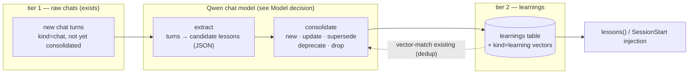
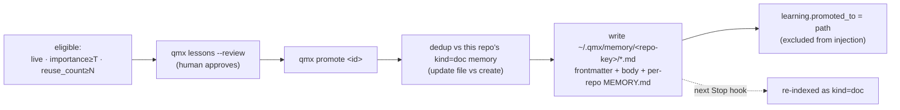

# qmx — Learnings & Consolidation (Capability #3) — implementation spec

> **Status: implemented** (Phases A–G). Schema v5 + `qmx.learnings`/`consolidate`/`session`/`promote`,
> CLI `add-learning`/`update-learning`/`deprecate-learning`/`restore-learning`/`lessons`
> (`--review`, `--deprecated`, `--include-retired`)/`consolidate`/`promote`, MCP `lessons` +
> `add_learning`/`update_learning`/`deprecate_learning`/`restore_learning`, and SessionStart/SessionEnd
> hooks. Model is config-driven (`chat_model`, default `qwen3.6:35b-a3b`).

Turns **raw recall** (`kind=chat` — past turns verbatim) into a **distilled tier** of reusable
lessons (`kind=learning`): *decisions*, *mistakes+corrections*, and *how-tos*, auto-drafted from
chats by a Qwen chat model, deduped/superseded so they self-correct, and **proactively injected** at
session start so the agent starts already knowing.

Design rationale (episodic-write → periodic-LLM-consolidate → cite-on-retrieve, and why we improve on
the reference always-on-memory pattern) lives in
[qmx-architecture.md](./qmx-architecture.md#capability-3). This doc is the buildable plan: schema,
pipeline, tools, triggers, phasing, and the **model decision**.

## What exists today (the gap)

Grep-confirmed: `"learning"` is only a *nominal* `kind` (a comment in `store.py`, the `query`
docstring, the `--kind` help). **No** `learnings` table, consolidation, `lessons`/`add_learning`
tools, or chat-model call. `Settings.chat_model = "qwen3"` is defined but **never invoked**. So
Capability #3 is 0% built; this spec is greenfield on top of the existing store/embed/search/MCP.

## Data model (schema v5)

```sql
CREATE TABLE learnings (
  learning_id   INTEGER PRIMARY KEY,
  type          TEXT NOT NULL,        -- decision | mistake | howto
  topic         TEXT,                 -- short slug for filtering/injection (e.g. "cpe-intelligence/dags")
  scope         TEXT,                 -- repo/project this applies to, or NULL = global
  statement     TEXT NOT NULL,        -- the lesson, one crisp sentence
  detail        TEXT,                 -- why / the correction / the better way
  importance    REAL NOT NULL,        -- 0..1, USED in retrieval ranking
  source_anchors TEXT,                -- JSON: [{session, transcript_path, line}] citations
  superseded_by INTEGER REFERENCES learnings(learning_id),  -- newer lesson that replaced this
  reuse_count   INTEGER DEFAULT 0,    -- times fired/injected/confirmed — the promotion gate
  last_fired_at TEXT,                 -- when last retrieved/injected (for recency + gate)
  promoted_to   TEXT,                 -- path of the curated memory/*.md it graduated to (NULL = not promoted)
  created_at    TEXT DEFAULT (datetime('now')),
  updated_at    TEXT DEFAULT (datetime('now')),
  deprecated_at     TEXT,             -- v5: soft-retired — hidden from retrieval, kept for audit
  deprecated_reason TEXT              -- v5: why it was retired (shown with include_retired)
);
-- statement+detail are also embedded into the existing chunk/vec/fts tables as kind="learning"
-- (one chunk per learning) so retrieval reuses vector + BM25 + rerank unchanged.

CREATE TABLE consolidated (               -- restart-safe cursor: which turns are already distilled
  chunk_id  INTEGER PRIMARY KEY REFERENCES chunks(chunk_id),
  at        TEXT DEFAULT (datetime('now'))
);
```

Live learnings = `superseded_by IS NULL AND deprecated_at IS NULL`. Retired ones are kept (audit
trail) but excluded from retrieval. The `consolidated` table (a `processed`-style cursor) makes the
extraction pass idempotent and resumable — re-running never re-distills the same turns.

### Lifecycle ops (v5)

The three markers are **orthogonal**, which is the point:

| Marker | Meaning | Set by |
|---|---|---|
| `superseded_by` | a newer lesson replaced this one — a breadcrumb, always kept | consolidate's `supersede`, or `deprecate --superseded-by` |
| `deprecated_at` / `deprecated_reason` | soft-retired: stops firing, **with or without** a replacement | `deprecate_learning` |
| `promoted_to` | graduated to a curated memory file | `promote` |

Before v5, retirement *required* a replacement row (`superseded_by` was the only "not live" signal),
so "this lesson is simply wrong and nothing replaces it" was inexpressible — the only options were to
leave it firing or to bury it under a synthetic replacement. `deprecated_at` fixes that; passing
`superseded_by` as well covers the corrected-value case (a stale price retired *and* pointed at its
replacement) in one call.

**Ops** (`qmx.learnings`, exposed over MCP and the CLI):

- `update_learning(id, …)` — fix a lesson **in place**: statement / detail / type / topic / scope /
  importance. Every field defaults to a `KEEP` sentinel and `None` *clears* a nullable column, so
  `scope=None` re-scopes to global. Two deliberate cost properties: the embedding backend is called
  **only** when an embedded field (type/topic/statement/detail) actually changed — so re-weighting
  works with the Spark down — and `scope` is mirrored onto the learning's `documents.repo` row rather
  than left to drift out of sync with scope-filtered retrieval.
- `deprecate_learning(id, reason=…, superseded_by=…)` — soft-retire; reversible.
- `restore_learning(id)` — clears the retire **and** supersede markers, making the lesson live again.

**Where hiding is enforced.** Retirement filters inside the two search arms
(`Store.search_vec` / `search_fts`, via `retired_learning_docs()`), not in `lessons()`. Filtering in
`lessons()` alone left a leak: raw `query --kind learning` bypasses it and still returned superseded
lessons. One chokepoint means retired lessons vanish from `lessons`, from `query`, and from the
consolidation judge's candidate pool alike; `include_retired=True` opts back in. Retirement is
metadata-only — the chunk, its mention and its embedding are untouched — so restore costs no
embedding call.

**Closing the loop in consolidation.** Hiding retired lessons from search also hides them from the
judge's own candidate lookup, which would make it re-learn a retired lesson as a fresh `new` row one
session later — retirement silently undone. So `_nearest_learnings` matches with
`include_retired=True` and budgets the two kinds separately (up to `_MATCH_POOL` live +
`_MATCH_RETIRED` retired), so context never displaces a live match the judge might have merged into,
and retired neighbours are rendered `[RETIRED: <reason>]` in the prompt. The judge then has five
actions:

| Action | Effect |
|---|---|
| `new` | insert the candidate |
| `update` | patch the target in place + re-embed |
| `supersede` | insert the candidate, retire the target pointing at it |
| `deprecate` | retire the target with a `reason`; **nothing is inserted** (no replacement exists) |
| `drop` | discard the candidate — it only re-learns a `[RETIRED]` lesson |

A retired lesson is never a valid `update`/`supersede`/`deprecate` target (`_valid_target` requires
liveness), so a stray decision cannot undo a retirement; an invalid target falls through to the
insert path, which risks a duplicate rather than losing a candidate. `deprecate` and `drop` are
counted on `ConsolidateResult` and reported by `qmx consolidate` — a candidate that disappears
without a trace is indistinguishable from one that was never extracted, so neither is silent.

**`importance` is a weight, not a rating.** It enters ranking as `W_IMPORTANCE × importance` (0.3)
while the entire relevance term is capped at `W_RELEVANCE` (0.5), so a lesson stored at 9.0
contributes 2.7 and outranks every genuinely relevant lesson — and clears the
`promotable(min_importance=…)` gate for free. The judge is asked for a decimal in 0..1 but sometimes
answers on a 1–5/1–10 scale, and consolidation's `update` decision used to write that raw number
straight through `store.update_learning` (only `add_learning` clamped). A real index accumulated
**281 of 1146** rows above 1.0, max 9.0.

Now guarded in three places: `normalize_importance()` rescales at the model boundary (dividing by 5
or 10 by apparent scale — *rescaling*, not clamping, since clamping flattens every over-range lesson
to joint-top priority), the store clamps on both `insert_learning` and `update_learning` so the
column's range holds for every caller, and the extract prompt spells out "a decimal between 0.0 and
1.0 (NOT a 1-5 or 1-10 rating)". Existing bad data is repaired with `qmx fix-importance` — a report
by default, writing only with `--apply`, via a store method that deliberately leaves `updated_at`
alone so a data fix cannot reorder recall through the recency term.

**Hard delete is deliberately absent from the MCP surface.** Its two legitimate uses — flat-out wrong
with no historical value, and confidentiality (a lesson that captured e.g. a negotiated rate) — are
human calls, so it is planned as a CLI-only verb. Two things it must handle when built: purge the
chunk/FTS/vector rows (otherwise the text stays full-text searchable, which defeats the
confidentiality case — safe to hard-delete because `add_learning`'s trailing `[#id]` marker keeps each
learning's chunk unshared), and refuse-or-warn on a non-NULL `promoted_to`, since the text also lives
in a curated `.md` file on disk that a DB delete does not touch.

## Pipeline


```mermaid
flowchart LR
  subgraph IN["tier 1 — raw chats (exists)"]
    T["new chat turns<br/>kind=chat, not yet consolidated"]
  end
  subgraph LLM["Qwen chat model (see Model decision)"]
    EX["extract<br/>turns → candidate lessons (JSON)"]
    CO["consolidate<br/>new · update · supersede<br/>deprecate · drop"]
  end
  subgraph OUT["tier 2 — learnings"]
    L[("learnings table<br/>+ kind=learning vectors")]
  end
  T --> EX --> CO --> L
  L -. "vector-match existing (dedup)" .-> CO
  L --> LES["lessons() / SessionStart injection"]
```

1. **Extract** (`extract_learnings(turns) -> [candidate]`): a Qwen pass over the un-`consolidated`
   turns of a session. Emits **structured JSON** candidates: `{type, topic, scope, statement, detail,
   importance, source_anchors}`. Prompted to keep only durable, reusable lessons (a decision + its
   why; a mistake + its correction; a repeatable how-to) and drop chit-chat. Cheap; runs per session.
2. **Consolidate** (`consolidate(candidate)`): for each candidate, vector-search existing
   `kind=learning` for near-duplicates; a Qwen call decides **new / update / supersede**. Supersede
   sets `superseded_by` on the stale row (self-correction). Prevents the blind-INSERT duplication of
   the reference design.
3. **Store**: insert/patch the `learnings` row; (re)embed `statement + detail` as a `kind=learning`
   chunk; mark the source turns `consolidated`.
4. **Retrieve** (`lessons(query|topic, type?, k)`): vector + BM25 over `kind=learning`, re-ranked by
   **relevance × importance × recency** (not relevance alone), returning lessons **with citations**.
5. **Inject** (SessionStart): resolve the current repo from `cwd`, select `scope`-matched + global
   lessons (see *Relevance & scope*), and surface the top few so the agent starts already knowing
   "last time bucket-level IAM failed → use project-level."

## Relevance & scope — two signals

Injection and pull answer *relevance* with **different signals**, because they run at different times:

| Channel | When it runs | Query available? | Relevance signal |
|---|---|---|---|
| **Inject** (`SessionStart`) | before the first prompt | **no** | **project identity** — `cwd` → repo → `scope` match |
| **Pull** (`lessons(query)`) | mid-task, on demand | **yes** | **vector + BM25** semantic match (optionally `scope`-filtered) |

The key constraint: **at `SessionStart` there is no query text yet**, so injection *cannot* rank by
meaning — the only signal is *which project you're in*. Injection is therefore **scope-keyed**;
semantic relevance is the job of the pull path once the agent has an actual question.

**`cwd` → canonical scope key.** The `SessionStart`/`SessionEnd` hook input includes `cwd`. Resolve it
to a stable repo identity:

1. Walk up to the git root; read **`git remote get-url origin`** → normalize to a canonical key
   (`Cruise/xtorch`, `the-dsvolk/qmx`).
2. **Use the remote, not the directory name.** Worktrees live under paths like
   `.claude/worktrees/qmx-learnings-plan` — the basename is useless as a key, but the remote is
   identical across every worktree/clone, so it's the stable identity.
3. Fallback if no remote: repo-root basename, matched against `code_roots` in config.

**The injection set** (per session), capped at the `SessionStart` **10,000-char `additionalContext`
budget** (see hooks contract below):

```
repo   = canonical_key(cwd)                 # e.g. "Cruise/xtorch"
inject = lessons WHERE scope == repo         # this project's lessons
       ∪ lessons WHERE scope IS NULL          # global / repo-agnostic lessons
       (superseded excluded, promoted_to IS NULL)
rank by importance × recency, fill up to the char budget
```

So a session in `xtorch` is injected with xtorch lessons + a few globals and **nothing from
`cpe-intelligence`** — cross-project noise is excluded structurally. An unknown / non-git `cwd` →
globals only (or nothing).

**Where `scope` comes from.** Each learning is stamped with `scope` at extraction — near-deterministic
because a Claude Code transcript already lives under `~/.claude/projects/<encoded-cwd>/`, so the
extractor derives the session's repo (same `git remote` normalization) and sets `scope` to it. The
Qwen pass may override (a lesson learned in repo A but *about* repo B → `scope = B`); `scope = NULL`
means the model judged it repo-agnostic (e.g. "always branch before editing").

## Triggers & wiring (Claude Code hooks)

- **`SessionEnd`** (or a turn counter in `qmx capture`) → `qmx consolidate` on that session's
  transcript. Consolidation is the heavier batch pass; keep it off the per-turn hot path. **The
  `SessionEnd` hook blocks session closure until it returns (600 s timeout), so consolidate must be
  spawned detached** (`nohup … &`, exit immediately) to avoid stalling the session close.
- **`SessionStart`** (matcher `startup`) → resolve `scope` from `cwd` (above), build the injection set,
  and return it as JSON `hookSpecificOutput.additionalContext` (the documented context-injection field,
  max 10,000 chars) — **not** stdout, which is not injected. This is the "proactive injection" payoff.
- `SessionEnd` receives `session_id` + `transcript_path` + `cwd`; both are `settings.json` hooks
  (harness-executed), added via the update-config skill, like the existing `Stop` capture hook.

## Surfaces

- **CLI:** `qmx consolidate [--session <path>] [--all]`, `qmx lessons <query|--topic> [--type] [-k]`,
  `qmx lessons --review` (list promotion-eligible), `qmx promote <id> [--project <p>]` (graduate to
  curated memory), `qmx add-learning ...` (manual seed).
- **MCP tools:** `lessons(query, type?, k)` (the read door for agents), and optional
  `add_learning(...)` / `consolidate()` write tools. Adds to the existing `query`/`search_code`/
  `recall`/`get`/`status` set.
- **Retrieval ranking** (`lessons`): `score = w_r·relevance + w_i·importance + w_t·recency`, tunable
  weights; superseded excluded.

## Consumption & promotion to curated memory

Two stores, deliberately separate — and a one-way graduation between them:

| | qmx learnings (`kind=learning`) | Curated memory (**per-repo** md files) |
|---|---|---|
| Owner | machine (auto-drafted) | human (hand-picked canon) |
| Volume | large, self-superseding | small, high-signal |
| Reaches the agent by | `lessons()` pull + SessionStart inject | **injected every session** (per-repo `MEMORY.md` + files) |
| Trust | probationary | canon |

The asymmetry that drives the design: **curated memory is loaded into *every* session**, so a
wrong entry there is expensive. Learnings are cheaper (an injected lesson can be ignored). Promotion
is the bridge — "this lesson earned a seat in the always-loaded canon."

### Per-project isolation (memory store keyed by repo)

**Each GitHub project gets its own isolated memory** — repo A's md files never mix with repo B's, in
storage *or* retrieval. The isolation boundary is the **canonical repo key** (the `git remote`
normalization from *Relevance & scope*), not the cwd path — so all worktrees/clones of one repo share
one coherent store, and two different repos never commingle.

```
~/.qmx/memory/
  Cruise__xtorch/            MEMORY.md + *.md   # scope = "Cruise/xtorch"
  the-dsvolk__qmx/           MEMORY.md + *.md   # scope = "the-dsvolk/qmx"
  _global/                   MEMORY.md + *.md   # scope = NULL (repo-agnostic)
```

- **Storage isolation:** `qmx promote` writes into the current repo's dir (`_global/` for `scope=NULL`
  lessons — this resolves the earlier "where does a global lesson go" question). Each dir has its own
  `MEMORY.md` index.
- **Retrieval isolation:** SessionStart injection loads **only** the current repo's dir + `_global` (the
  scope filter already specced), so no cross-project bleed. These files are indexed as `kind=doc` for
  search, tagged with their `scope`.
- **Worktree-stable:** because the key is the remote, promoting from `.claude/worktrees/qmx-…` lands in
  `the-dsvolk__qmx/`, not a per-worktree dir.
- *(Optional, config)* the per-repo store can instead target an **in-repo** dir (e.g. `.qmx/memory/`,
  committed with the project) for team-shared canon; default is the home-dir store above, to avoid
  writing into source repos.

> Note: this per-repo store is qmx's promotion target and injection source; it is distinct from
> Claude Code's native `~/.claude/projects/<cwd>/memory/` (which is keyed by cwd and thus
> worktree-fragmented). qmx still indexes those native files as `kind=doc`, but graduates learnings
> into the repo-keyed store so isolation holds across worktrees.

**How learnings are used (two channels):** *pull* — `lessons(query, type?, k)` MCP tool, agent asks
mid-task; *push* — the `SessionStart` hook injects the top-k scoped lessons.

**Promotion loop (learning → memory), human-gated:**


```mermaid
flowchart LR
  E["eligible:<br/>live · importance≥T · reuse_count≥N"] --> R["qmx lessons --review<br/>(human approves)"]
  R --> P["qmx promote &lt;id&gt;"]
  P --> D["dedup vs this repo's kind=doc memory<br/>(update file vs create)"]
  D --> W["write ~/.qmx/memory/&lt;repo-key&gt;/*.md<br/>frontmatter + body + per-repo MEMORY.md"]
  W --> S["learning.promoted_to = path<br/>(excluded from injection)"]
  W -. "next Stop hook" .-> IDX["re-indexed as kind=doc"]
```

1. **Gate (eligibility):** `live AND importance ≥ T AND reuse_count ≥ N` → surfaces in
   `qmx lessons --review`. **A human approves each promotion** (canon is loaded everywhere; qmx never
   auto-edits curated files — it only auto-writes its own DB).
2. **`qmx promote <id> [--project <p>]`** then:
   - **Type-maps** the learning to a memory `metadata.type`:

     | learning.type | → memory type | body shape |
     |---|---|---|
     | `mistake` / `howto` | `feedback` | statement + **Why:** + **How to apply:** |
     | `decision` (scoped) | `project` | statement + rationale |
     | pointer/resource | `reference` | URL / anchor |
   - **Dedups against this repo's canon first** — memory is already indexed as `kind=doc`, so
     vector-match the learning against the current repo's `memory/*.md` and **update the matching file**
     rather than duplicate it.
   - **Writes** into the repo-keyed store `~/.qmx/memory/<repo-key>/` (`_global/` for `scope=NULL`):
     valid frontmatter (`name` kebab-slug, `description` = the statement, `metadata.type`), body,
     `[[links]]` to related memories, **and appends the one-line pointer to that dir's `MEMORY.md`**.
   - **Closes the loop:** sets `learning.promoted_to = <path>` and **excludes promoted learnings from
     SessionStart injection** (else it double-surfaces — the memory system loads it *and* qmx injects
     it). The next `Stop` hook re-indexes the new file as `kind=doc`, so it's searchable both ways.
3. **Reverse direction — canon wins:** during `consolidate`, also vector-match candidates against
   `kind=doc` memory. A candidate that merely **restates** canon is dropped (no learning minted); one
   that **contradicts** a curated file is **flagged for review**, never silently superseded. This keeps
   the repo convention intact: promotion produces a real `.md` (source of truth); the learnings DB
   stays a rebuildable shadow.

## Model decision (which chat model, and is an NVFP4 one useful?)

The consolidation model does **reasoning/judgment**: read a conversation, decide what's a durable
lesson, write a crisp `statement`+`detail`, emit clean JSON, and judge new-vs-supersede against
existing lessons. **Model quality directly shapes output quality** (junk/duplicate lessons vs good
ones) — so this is the *first* qmx component where a bigger model genuinely helps (unlike the 0.6B
embedder/reranker, where it doesn't). Two facts shape the choice:

- It is **batch and low-QPS** — a few calls at session end, seconds-to-minutes latency is fine. So
  **throughput doesn't matter**; judgment does.
- The Spark has **~128 GB unified memory** — a mid-size model at Q8/BF16 fits with huge headroom.

**v1 — [`qwen3.6:35b-a3b`](https://ollama.com/library/qwen3.6) on the existing Ollama stack
(recommended).** Qwen3.6 (Apr 2026, [model card](https://huggingface.co/Qwen/Qwen3.6-35B-A3B),
[release notes](https://qwen.ai/blog?id=qwen3.6-35b-a3b)) is a **MoE — 35B total / 3B active** — so it
runs at small-model speed (~20 GB Q4, trivial in the Spark's 128 GB) while delivering big-model
judgment. Its headline gains are exactly this task's inputs: **repo-level reasoning + agentic coding**
(the transcripts *are* coding sessions) and **thinking-preservation across turns**. Reuse
`Settings.chat_model` + Ollama (already serving embeddings on the Spark) — **no new serving infra**,
structured output via Ollama's `format`/JSON-schema. Newer and stronger than the 3.5-era 35B-A3B for a
consolidation judge. This ships the feature.

**Config, not hardcoded.** The consolidation model is read from **`Settings.chat_model`**
(`~/.qmx/config.toml`, override `QMX_CHAT_MODEL`) — exactly like `embed_model` / `rerank_url` today.
Code references the setting only; **no model string is hardcoded** in the extract/consolidate calls.
Update the current default (`chat_model = "qwen3"`) to **`"qwen3.6:35b-a3b"`**, so swapping models
(or pointing the deferred vLLM judge at a different endpoint via a `chat_url`) is a config edit, never
a code change.

**NVFP4 models from the [unsloth collection](https://huggingface.co/collections/unsloth/nvfp4) —
the one place in qmx they could pay off, but deferred.** They are **large generative Qwen/Gemma/GLM,
safetensors for vLLM/TensorRT-LLM (not GGUF → not Ollama/llama.cpp)**. Because consolidation *rewards*
better judgment, a heavier judge would produce higher-quality, better-deduped lessons — and NVFP4 on
the GB10 (Blackwell/sm_121, native FP4) runs such a model fast and compact. The concrete deferred pick
is **`Qwen3.5-122B-A10B` in NVFP4** (122B total / 10B active; ~60 GB in FP4 — fits 128 GB) — the
max-judgment consolidator. **But:** (a) it needs standing up **vLLM** (a new serving stack); (b) the
3.6-35B-A3B v1 already runs on Ollama *without* NVFP4, so NVFP4 buys **speed/room + a bigger judge, not
feasibility**; and (c) throughput is irrelevant for a batch job. **Decision: v1 uses
`qwen3.6:35b-a3b` on Ollama.** Only if v1 lesson quality proves insufficient do we move *the
consolidation model specifically* to **`Qwen3.5-122B-A10B` NVFP4 on vLLM** — a documented upgrade
path, not a launch dependency.

## Phasing

| Phase | Deliverable | Acceptance |
|---|---|---|
| **A** | `learnings` table + `kind=learning` embed/retrieve; `lessons()` CLI+MCP; `add_learning` (manual) | seed 3 lessons, `lessons "iam pr"` returns them ranked by relevance×importance×recency, with citations |
| **B** | `extract_learnings` (Qwen) + `qmx consolidate` over a session; `consolidated` cursor | run on a real transcript → sensible decision/mistake/howto lessons; re-run embeds 0 (idempotent) |
| **C** | dedup + **supersede** (vector-match + Qwen judge) | a corrected lesson supersedes the stale one; superseded excluded from `lessons` |
| **D** | `SessionEnd` (consolidate) + `SessionStart` (inject) hooks | new lesson appears after a session; next session is injected with relevant lessons |
| **E** | **Promotion + per-repo isolation:** repo-keyed store `~/.qmx/memory/<repo-key>/` (+ `_global/`); `qmx lessons --review` + `qmx promote <id>` (type-map, dedup vs this repo's `kind=doc` memory, write frontmatter + per-repo MEMORY.md pointer, set `promoted_to`) | approve an eligible lesson in `xtorch` → a valid md lands in `Cruise__xtorch/` (updates the matching file, not a dup) with its pointer in that dir's MEMORY.md; promoting from a worktree lands in the same repo dir; a `cpe-intelligence` session is never injected with xtorch's files; the promoted learning stops being injected |
| **F** | **Lifecycle ops (schema v5):** in-place `update_learning`; `deprecate_learning` (+ optional `superseded_by`) / `restore_learning`; retired-hiding enforced in the search arms; `include_retired` opt-in; MCP + CLI surfaces | a wrong lesson is corrected in place (same id, no duplicate); an importance-only edit makes **zero** embedding calls; a retired lesson stops appearing in `lessons` **and** `query --kind learning` and in injection, still lists under `lessons --deprecated` with its reason + replacement, and `restore-learning` brings it back with no re-embed; a v4 DB migrates in place |
| **G** | **Retirement in the pipeline:** judge actions `deprecate` + `drop`; `_nearest_learnings` matches with `include_retired=True` (live/retired budgeted separately, retired rendered `[RETIRED: reason]`); `_valid_target` requires liveness; `deprecated`/`dropped` counted and reported | the judge retires a wrong lesson with no replacement stored (row count unchanged, reason recorded); a candidate re-learning a retired lesson is dropped instead of re-added as `new`, and the retired lesson provably reaches the prompt; an `update`/`supersede` aimed at a retired target leaves it untouched and inserts instead of losing the candidate |

## Open questions

1. **Extraction granularity** — per-session batch (recommended) vs per-turn tagging + periodic merge.
2. **Importance calibration** — model-assigned `importance` vs a heuristic (recency of correction,
   was-a-mistake) vs human review.
3. **Scope/injection** — how aggressively to inject at SessionStart (top-k, token budget) and how to
   match `scope` to the current cwd/project without noise.
4. **Promotion gate tuning** — the eligibility thresholds (`importance ≥ T`, `reuse_count ≥ N`) are
   TBD; promotion itself is **human-gated** (decided). Should very-high-confidence lessons ever
   auto-promote, or always pass through `--review`? (v1: always review.)
5. **Trust** — a learning can encode a wrong conclusion; supersede + importance + the human review
   gate mitigate, and phase F adds correction in place + soft-retire (so a wrong lesson can be fixed
   or silenced, not merely out-weighted). Should low-confidence lessons be quarantined until reused?
6. **Re-learning a retired lesson** — `drop` keeps the retirement, deliberately trusting the human's
   retirement over the model's re-learning; the count surfaces in `qmx consolidate` output. If a
   lesson keeps getting re-learned, that is a signal the retirement was wrong — should the judge be
   allowed to `restore` it (currently a human/agent-only op), or should repeated drops just be
   reported for review? (v1: report, never auto-restore.)
